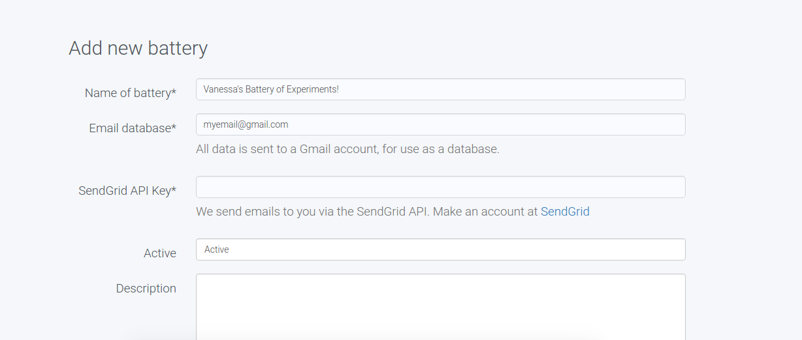
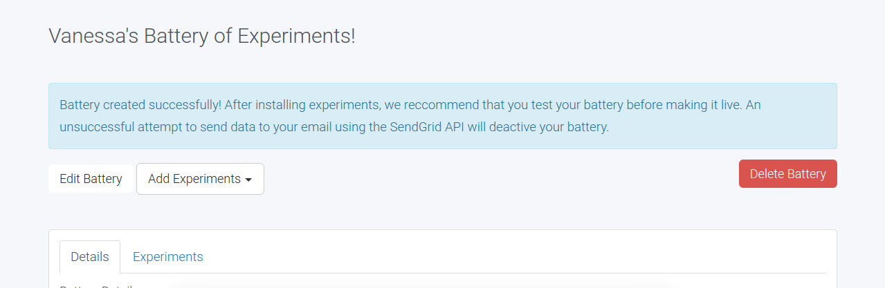
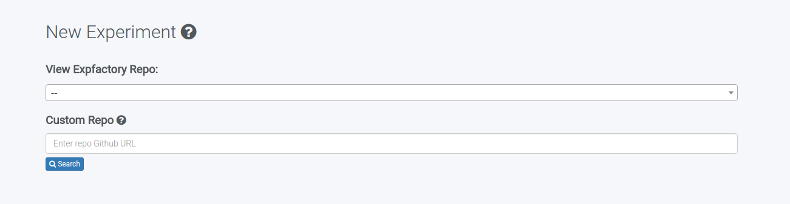
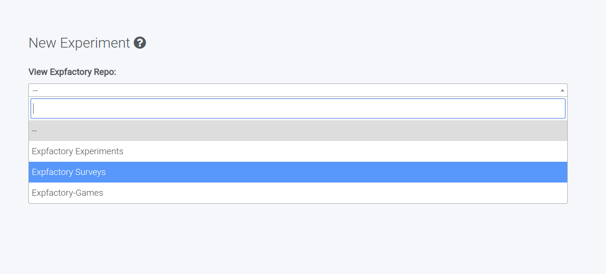
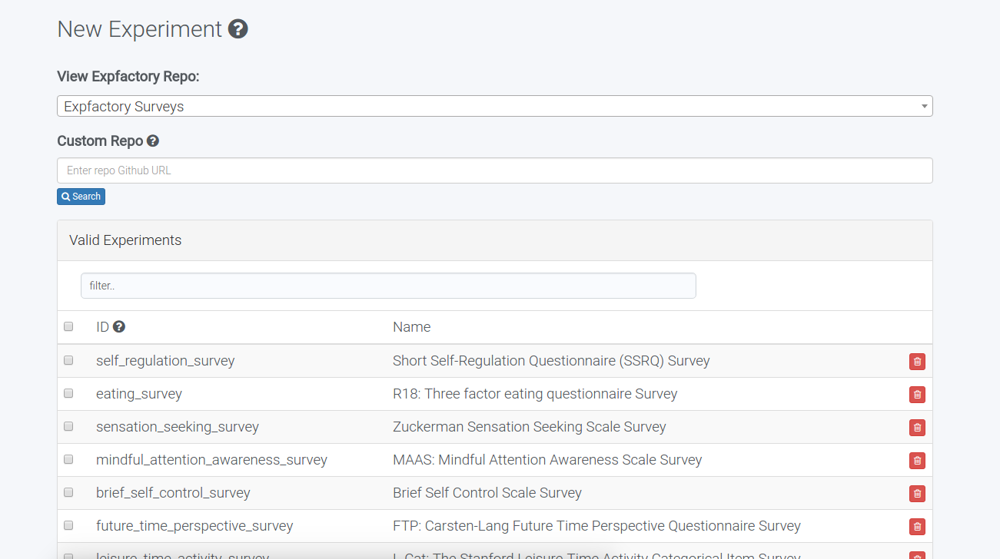

### Docker and The Experiment Factory

   >> Don't forget what happened to the researcher who suddenly got everything he wanted.

   >> What happened?

   >> He started using Docker.

# For Users

## About Expfactory

This is the Experiment Factory application, verison 2.0, developed by @vsoch, which has several important updates:

#### Experiments are unique to a battery. 
This means that when you install an experiment, it is owned by you, sitting in a folder that you control. The old version 1.0 expected users to share templates. While this might have made sense for reproducibility, it didn't empower the user to install his or her own experiments, or have any control over them. That's changed.

#### Use our templates, or not. 
We have spent quite a bit of time developing [surveys and experiments](http://expfactory.github.io/table.html) that render from a simple tab delimited file or single javascript file ([example survey](https://github.com/expfactory/surveys/blob/master/bis11_survey/survey.tsv),[example experiment](https://github.com/expfactory/experiments/blob/master/adaptive_n_back/experiment.js)), however what if you have your own static experiment that you want to run? The Experiment Factory now supports custom experiments. You simply change the "template" variable to `custom`, create a config.json to put in the experiment folder, and you can upload it to our interface.

#### We don't store your data
The data gets submit from our interface and is sent directly to you. For an open source project, there is much liability in having the responsibility to maintain your data. This was preventing us from opening up the application to the larger public, and the lead developer had great issue with this, as it wasn't her vision to have the application be exclusive. Instead, we have you create a [SendGrid](https://app.sendgrid.com/signup) API key, and an email account that will be used exclusively for your results. SendGrid gives you 12,000 email sends per month, and that will work quite well for most single studies. On the email side, a standard Gmail account would let you store upwards of 17K results, given that a result is 1MB in size. And we know this might get annoying to deal with, so we are developing tools that will allow you to automatically parse the results from your email, and send them to your "real" database of choice. 

#### Better Data Protection
For version 1.0, the URL to paricipate in an experiment was shared on MTurk, and a user could put in a faux ID and potentially spam the server. In version 2.0, your battery is associated with a unique URL that must be given out by the researcher to participants. Once the participant has accepted to participate, a unique session is stored that will carry the participant through the battery, even if he/she closes the browser. If there is funny business, such as a battery result not sending, we have checks that will deactivate your battery to prevent data loss. 

#### Mechnical Turk is removed
...for now. Storing AWS credientials was another huge liability, and while functionality like this would be desired for the future, it should not be an embedded part of the application. In version 1.0, MTurk was an integrted part of the application, and in version 2.0 it (will be) more of a plugin.

Overall, the Experiment Factory is intended to be a place to develop, share, and deploy web-based experiments. It is not intended to be a data warehouse, or optimized for anything but that function, and this was the original vision of the main developer. Please submit feedback and feature requests as an [issue](http://www.github.com/expfactory/expfactory/issues). I am hopeful that with a simplified, more robust application, the Experiment Factory can be used as it was originally intended, to empower all researchers to easily conduct web-based experiments.

## Using the Experiment Factory

You will be able to create sequences of experiments, each called a battery, either using one of our [survey or experiment templates](https://expfactory.github.io/table.html) or uploading your own experiment. For a quick getting started, once you register and login to the interface, you can create a battery:

The only essential fields are to specify your [SendGrid](https://app.sendgrid.com/signup) API key, and the email to which the results will be sent. The remaining fields (time limits, instructions, advertisement, etc.) are optional.

Once you have created a battery, you should add experiments to it! You can "Upload from Github" or "Create" new using our interface:

#### Install from Github
We've done quite a bit of work to make a bunch of great [experiments and surveys](http://expfactory.github.io) that you can deploy with a few clicks. When you select to upload from Github you will see an option to select one of our repos, or copy paste a link to your own repo:

We are currently offering surveys and experiments by way of the [JsPsych framework](https://github.com/jodeleeuw/jsPsych), a great framework by Josh DeLeeuw.

When you click `search`, all valid experiments in your chosen repo will be available for install. If you don't see an experiment it means that it didn't pass validation, and you should use our [command line tools and robot](http://expfactory.readthedocs.io/en/latest/development.html#testing) to test your experiment folders.

###### What is a valid experiment?
All valid experiments must have a [config.json](http://expfactory.readthedocs.io/en/latest/development.html?highlight=config#config-json) file, where you specify scripts needed at runtime, a unique id called an `exp_id`, and other variables that are needed by our application. We've created special "template" experiments for [material-design-light surveys](http://expfactory.readthedocs.io/en/latest/getmdl.io) and jspsych experiments that you would specify in the `template` variable, but you don't have to use them. All valid experiments, whether you use a template or your own custom, must have the following:

- a config.json file
- all file paths served relative to the experiment folder
- all scripts provided by CDN (suggested), or in the experiment folder

Surveys must have a `survey.tsv` file with questions ([example survey](https://github.com/expfactory/surveys/blob/master/bis11_survey/survey.tsv)) and jspsych experiments must have an [experiment.js](http://expfactory.readthedocs.io/en/latest/development.html#experiment-js) file that meets certian criteria.

###### What is a custom experiment?
A custom experiment has a template variable `custom` in the config.json, and along with the above list, it MUST have a "template.html" file in the folder that contains the following substitution tags:

 - {{form_submit}} should be in some form action, and this will be substituted with a server URL by our application
 - {{css}}: optional. Any .css files in the "run" variable of the config.json will be rendered at this tag, with the appropriate server path substitued.
 - {{js}}: same as above, but for javascript.

For CDN served files, you can specify them in the `run` variable in the config.json, or directly in the template.html. That's it!

## Future and In Progress

@vsoch (I) am starting a new job, and so development is done in my free time, but I have many plans for improved functionality, including:

#### Integration with Open Science Framework
Your experiments will have a unique id and version that will link with the open science framework, so experiments can be registered along with the rest of your study protocol.

#### Online Experiment Generation
Online generation of surveys is almost complete, and the same would be desired for experiments. The Jspsych experiments aren't yet optimized to be easy (you need to know how to code in JavaScript), and I don't find this acceptable. While it's important for researchers to know how to code, generation of experiments should be easy.

#### Better Experiment Customization
Right now, our templates take in a limited set of variables defined in the config.json to customize the experiments. This will either be expanded and made easier, or this functionality will be integrated directly into the interface.

See our [issues board](http://www.github.com/expfactory/expfactory/issues) for more plans, and please submit one (or many!) of your own with feedback if you have ideas. 

# For Developers

## Setup for Local Development
Thanks to @NeuroVault for these steps.

### Installing dependencies
1. Fork the [main repository](https://github.com/expfactory/expfactory-docker)
2. Clone your fork to your computer: `git clone https://github.com/<your_username>/expfactory-docker`

  >> *Warning: if you are using OS X you have to clone the repository to a subfolder in your home folder - `/Users/<your_username/...` - otherwise boot2docker will not be able to mount code directories and will fail silently.*

3. Install docker >= 1.6 (If you are using OS X you'll also need boot2docker)
4. Install docker-compose >= 1.2
5. If you are using OS X and homebrew steps 3 and 4 can be achieved by: `brew update && brew install docker boot2docker docker-compose`
6. Make sure your docker daemon is running (on OS X: `boot2docker init && boot2docker up`)

### Running the server
To run the server in detached mode, do:

      docker-compose up -d

The webpage will be available at 127.0.0.1 (unless you are using boot2docker - then run `boot2docker ip` to figure out which IP address you need to use). You can also run the server in non-detached mode, which shows all the logs in realtime.

      docker-compose up

### Stopping the server
To stop the server:

      docker-compose stop

### Restarting the server
After making changes to the code you need to restart the server (but just the uwsgi component):

      docker-compose restart uwsgi worker nginx

### Reseting the server
If you would like to reset the server and clean the database:

      docker-compose stop
      docker-compose rm
      docker-compose up

### Running Django shell
If you want to interactively develop, it can be helpful to do so in the Django shell. Thank goodness we can still connect to it in the floaty Docker container with the following!

      docker-compose run --rm uwsgi python manage.py shell

### Connecting to Running container
It can be helpful to debug by connecting to a running container. First you need to find the id of the uwsgi container:

      docker ps

Then you can connect:

      docker exec -i -t [container_id] bash

### Running tests

      docker-compose run --rm uwsgi python manage.py test

### Updating docker image
Any change to the python code needs to update the docker image, which could be adding a new package to requirements.txt. If there is any reason that you would need to modify the Dockerfile or rebuild the image, do:

     docker build -t vanessa/expfactory .

## Getting Started
Before bringing up your container, you must create a file `secrets.py` in the expdj folder with the following:

      DOMAIN_NAME = "https://expfactory.org" # MUST BE HTTPS FOR MECHANICAL TURK

You will also need to define a SendMail username and password for sending results to email:

      EMAIL_HOST_USER = 'sendmail_username'
      EMAIL_HOST_PASSWORD = 'sendmail_password

Note that this API will let you use their SMTP server, giving you 12K emails per month. Then you can bring up the container (see steps at beginning of README), essentially:

      docker-compose up -d

You will then need to log into the container to create the superuser. First do docker ps to get the container id of the uwsgi that is running vanessa/expfactory image, and then connect to the running container:

      docker ps
      docker exec -it [container_id] bash

Then you will want to make sure migrations are done, and then you can [interactively generate a superuser](scripts/generate_superuser.py):

      python manage.py makemigrations
      python manage.py syncdb
      python manage.py shell

Then to create your superuser, for example:

      from django.contrib.auth.models import User
      User.objects.create_superuser(username='ADMINUSER', password='ADMINPASS', email='')

and replace `ADMINUSER` and `ADMINPASS` with your chosen username and password, respectively. Finally, you will want to download the most recent battery files:

      python scripts/download_battery.py
      python manage.py collectstatic

The last step is probably not necessary, but it's good to be sure.

## Setup for Production
Log into the production server, and you can run [scripts/prepare_instance.sh](scripts/prepare_instance.sh) to install docker and docker-compose. This script will download the repo and build the image. You can then use the commands specified previously to bring up the image (e.g., `docker-compose up -d`). In the case of using something like AWS, we suggest that before building the image, you create an encrypted (separate) database, and add the credentials to it in your settings.py. There are unfortunately things you will need to do manually to get HTTPS working (see below). You should do the following:

### Site Name
Use the script [scripts/name_site.py](scripts/name_site.py) to name the site. You will need to log into the instance and run this to do so. When it's running (after `docker-compose up -d` first find the id of the container that has the `/code` directory:

      docker ps

Then connect to it interactively:

      docker exec -it CONTAINERID bash

and run the script. You can also copy paste the code into the interactive shell generated with `python manage.py shell`.

### Encrypted database connection
If your provider (eg aws) provides you with a certificate, you can add it to `/etc/ssl/certs` on the server, and this path is already mapped in the docker-compose for the nginx container. You then need to specify to use SSL in the database connection in your `settings.py` or `local_settings.py`:

      DATABASES = {
          'default': {
              'ENGINE': 'django.db.backends.postgresql_psycopg2',
              'NAME': 'dbname',
              'USER': 'dbuser',
              'PASSWORD':'dbpassword',
              'HOST': 'dbhost',
              'PORT': '5432',
              'OPTIONS': {
                      'sslmode': 'require',
                      'sslrootcert':'/etc/ssl/certs/rds-cert.pem'
              },
          }
      }

### Installing Experiments
Generally, any folder with an index.html serving some experiment, and submitting data via a form will work in the Experiment Factory. Your experiment should have a main `index.html` file with the form action to be a variable for substitution:

      <form action="{{ form_action }}" ...>
      ...
      </form>

We suggest you take advantage of a [content delivery network](https://cdnjs.com/) (CDN) to serve javascript and style sheets, however any additional files that you might need (images, js, or css) can be included in your experiment directory.

##### Surveys
You can most easily generate a survey by following our [surveys](https://github.com/expfactory/surveys) example. You just need a `survey.tsv` file with questions, and make sure to specify `survey` as the `template` variable in the config.json. To install a survey, you can Generate a battery, add an experiment to it, and either select "Expfactory Surveys" or your own Github URL with a folder that has a config.json for a survey inside.
